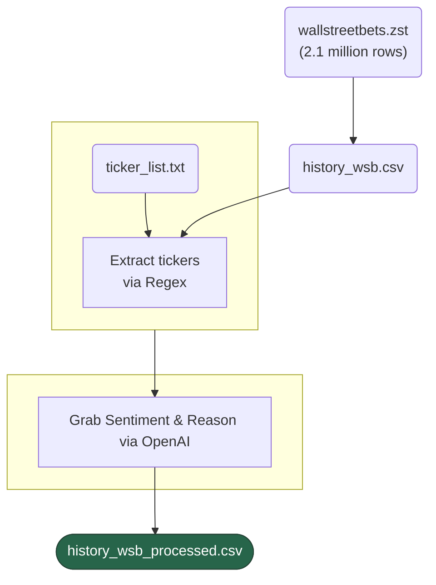
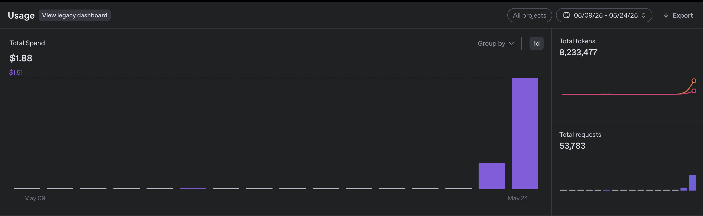
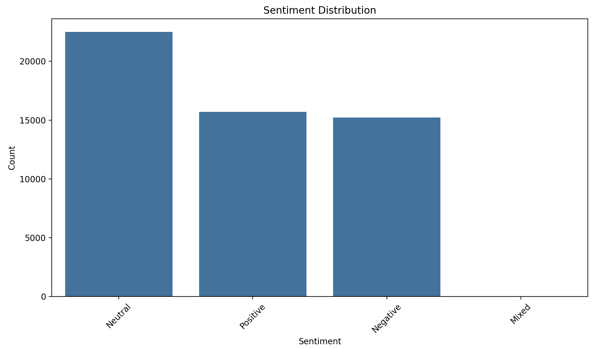
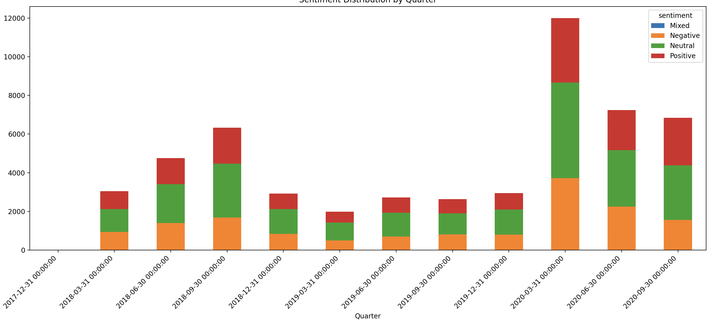
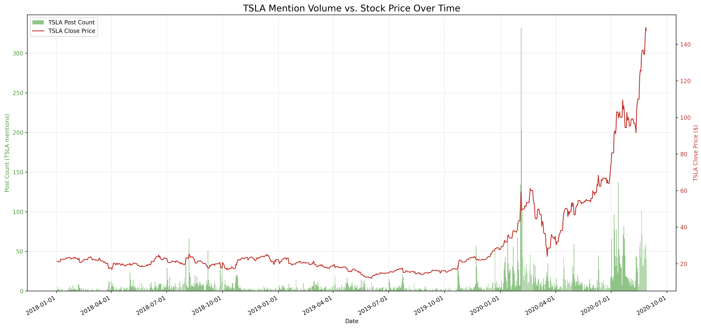
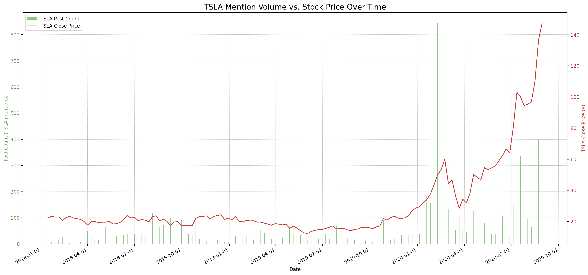
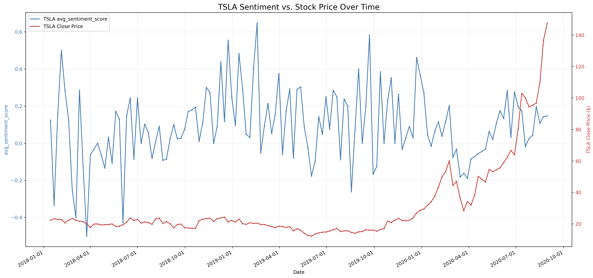

# Wallstreet Bets Analysis 2017:12:31-2020:08:20 on ~100 relevant tickers
 >Still a **work in progress**, to learn about sentiment analysis, large datasets, sentiment analysis (via OpenAI), and data visualization. 
  
  ### Tools Used:
 * Python - (Pandas, Matplotlib, yfinance)
 * OpenAI API
 * Open source data from Pushshift


## General Process



# Data

**Note** I only ran the analysis to **360,000** out of **~2.1 million** data points. Full data set is up to 2022 (this has the notorious GME data).


* Data grabbed from Pushshift data dump. ~2.1 million rows of data of wallstreetbets. Credit *https://github.com/Watchful1/PushshiftDumps/tree/master* for `for_data/dig_through.py`.

* Goal 1: To analyze the sentiment of posts related to specific stock tickers, particularly focusing on Tesla (TSLA), and to understand the overall sentiment trends in the Wallstreet Bets subreddit.
* Goal 2: Use OpenAI's API to see if valid for analyzing data, with giving reasoning for the sentiment, to see if it is worth pursuing for future projects.

# Overview of Wallstreet Bets Data
## Costs of Analysis
**OpenAI API**: 53,438 were apart of the relevant tickers, costing a total of 1.88$.




**Prompt:**
```python
messages = [
    {"role": "system", "content": "You are an AI expert in financial and meme sentiment analysis. Analyze the sentiment of the provided Reddit post text. "
                                 "Respond with a JSON object containing two keys: "
                                 "'sentiment' (string: 'Positive', 'Negative', or 'Neutral') and "
                                 "'ai_reason' (string: a brief, one-sentence explanation for the sentiment)."},
    {"role": "user", "content": f"Analyze the following text: \"{processed_text}\""}
]
```

## Overview
### **Sentiment Distribution**





```
Top 20 Most Mentioned Tickers:
ticker_symbol
TSLA    8651
AMD     5081
MU      4204
MSFT    2930
AAPL    2446
AMZN    2429
SPCE    2315
COST    1730
DOW     1713
...     ...
```

## TSLA (Tesla, Inc.) Overview

**8653 relevant to TSLA.**
Read *tesla.py* for more details on how the data was processed.

### Volume



### Sentiment



**Note**: Warning false positives, read below.


# Thought Process
We'll use pandas as our main data manipulation library, along with using a chunk_size to read in smaller dataframes, since our dataset is 2_100_000 (2115057) rows. Also we will use the 4o-mini from OpenAI to get sentiment. **Note** I only ran the analysis to 360,000 (2020:08:20 **for now**).

**Reason** I did a small project before with Sentiment Analysis: using databases, VADER, and scraping Reddit data, but ran into problems with Sentiment Analysis, and just overall data; I only scraped around 3200 data points.

* Check out wsb_sub_processed.txt (originally a csv file) for the processed data, used with OpenAI to get sentiment and reason for it, along with some extracted tickers.


## Main Lessons Learned:
1. **Data Extraction**: Extracting relevant tickers from the text data can be tricky, especially with false positives. Using regex is a good start, but further refinement is needed to ensure accuracy.
2. **Sentiment Analysis**: Using OpenAI's models for sentiment analysis can provide valuable insights (reasoning, neutral sentiment *see below*), but it can be slow and may require careful management of API rate limits, especially with large datasets, considering the latency involved.
3. **Data**: Some tickers may not be captured, and some may be false positives (using a partial ticker list or more common list). But allowing the whole dataset to be in there allows for future updates and analysis.
* **Data Continued**: For example when running through the files, (currently on chunk 189: 94,500 rows) F for Ford is probably getting so many false positives. Two examples of AI, one bad, one good:
```
TITLE: Volatility
SELF_TEXT: RIP inverse volatility bulls press f for respect,
AI_sentiment: Negative
AI_reason: "The phrase 'volatility btfo' suggests a strong negative sentiment towards market volatility, while 'press f to pay respects' implies a sense of loss or mourning.
REGEX Detected Tickers: ["F"]

but for respect to the AI:

TITLE: Please up vote to pay respect to MrTrader1
SELF_TEXT: MrTrader1 has been busy with his massive shorts campaign. Please press F to pay respect to MrTrader1
AI_sentiment: Neutral
AI_reason: The post is a request for respect and acknowledgment without expressing strong positive or negative emotions.
REGEX Detected Tickers: ["F"]
```
How many press F to pay respects posts are there? I'll probably have to filter out the ones are not relevant -- delete them all.

4. **CSV Handling**: I realize that CSV files are dangerous to work on. One mistep, and you can lose all your data. I recommend using a database or at least a backup of the CSV file before making any changes.


## 'Along the way' Thought Process:
I first used create_headers.py just to create the headers for the csv file.
I found some things like this in the beginning:
```
[]                 326
["MU"]              27
["T"]               27
["AMD"]             18
["NOW"]             18
["AMD", "INTC"]      5
["BAC"]              4
["TSLA"]             4
["NVDA"]             3
["NOW", "T"]         2
```
Which are value counts of the extracted tickers. I first just decided to use regex, as I actually do come across it often (wow). 
MU is Micron Technology, Inc. (MU), T is AT&T, and NOW is ServiceNow, BAC is Bank of America. I had a feeling that MU and T and BAC may be some false positives.

An example:
```
Couldn't sleep and was scrolling through the top posts of the last year. May have doomed us for market open.
  Selftext: Opened an archived money boi post and couldn't upvote in 12 seconds.
  Detected Tickers: ["T"]
```

Yes, this is a false positive due to the "counldn**'t** sleep".

After this, I just re-parsed the data, (grabbing the whole dataset) rather than extracting ones with tickers, that way it can be updated.

Changed it to 
```
["AMD"]             27
["MU"]              26
["TSLA"]             8
["AMD", "INTC"]      5
["NVDA"]             4
["BAC"]              4
["BABA"]             3
["INTC"]             2
```
Betterish.

Here's some data with first getting openAI to suggest sentiment and reason:
```
Head of processed chunk:
   score        date  ...                                          ai_reason   tickers
0      3  2017-12-31  ...  The post expresses a positive sentiment due to...  ["AAPL"]
1     66  2017-12-31  ...                                               None        []
2      1  2017-12-31  ...                                               None        []
3      2  2017-12-31  ...  The post expresses a sense of liberation and e...     ["F"]
4     12  2017-12-31  ...                                               None        []
```

** Update: I've been currently running the data, it is quite slow though. My rate limit for OpenAI is 5000 requests per minute. What's taking so long? 

My rate limit is 5000 requests for OpenAI, I've changed the code to allow for skipping chunks, but also allow for room for the rate limit, as 0.001 is verrryy fast, 0.02 is closer to the ideal (~50 requests per second) in a perfect world, I believe that latency is the main issue. (May turn into a different project for this, and maybe technically OpenAI is not the best for this, rather back to my simple use of a static sentiment analysis model-- *but the reasoning is a main part of seeing if it is worth pursuing*)


Ford stock is definitely broken. As you read above, lots of false positives for 'press f to pay respects', or honestly just 'f'. 

Going to leave this on overnight, and see how it goes! 
[update] Got up to 720 chunks, which is 360,000 rows, and on the relevant tickers, there are 53,438 data points. Better than my previous project. Lot's of other ideas popping up, especially for image analysis.

Overall, great learning lesson.


